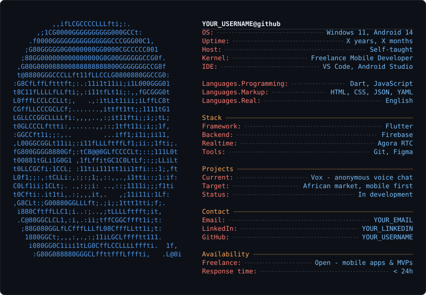

<!--
  YOUR_USERNAME/YOUR_USERNAME  -  profile README
  The card below is a plain image file. Nothing runs, nothing can break.
-->

<div align="center">



</div>

<div align="center">

[](mailto:YOUR_EMAIL)
[](https://linkedin.com/in/YOUR_LINKEDIN)


</div>

---

## Setup

**1. Make the repo**
Create a public repo named exactly your GitHub username (`YOUR_USERNAME/YOUR_USERNAME`).
Put `README.md` and `profile-card.svg` in the root.

**2. Put your own face in the ASCII art**

```bash
pip install pillow
python3 make_card.py my-photo.jpg
```

That overwrites `profile-card.svg`. Commit it and you're done.

Photo tips: head and shoulders, face filling most of the frame, plain
background, strong light/dark contrast. Crop it square first. A busy
background turns into visual mush at 42x26 characters.

**3. Edit the text**
Open `make_card.py` and edit the `FIELDS` list near the top. Each line is
`("row", "Label", "Value")`. Use `("sec", "Section Name", "")` for a
header and `("gap", "", "")` for a blank line. Re-run the script.

## Why a committed SVG

The card is generated once and committed as a file. It does not call any
API when someone views your profile, so it cannot rate-limit, go down, or
leak a token. The tradeoff is that the numbers do not update themselves —
you re-run the script when something changes. For a profile with few
commits so far, that is the right tradeoff.
